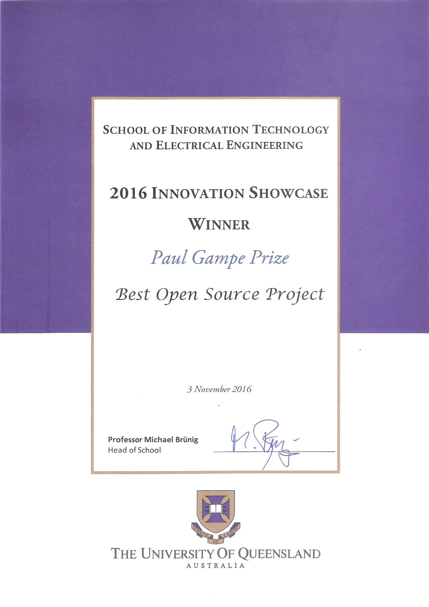
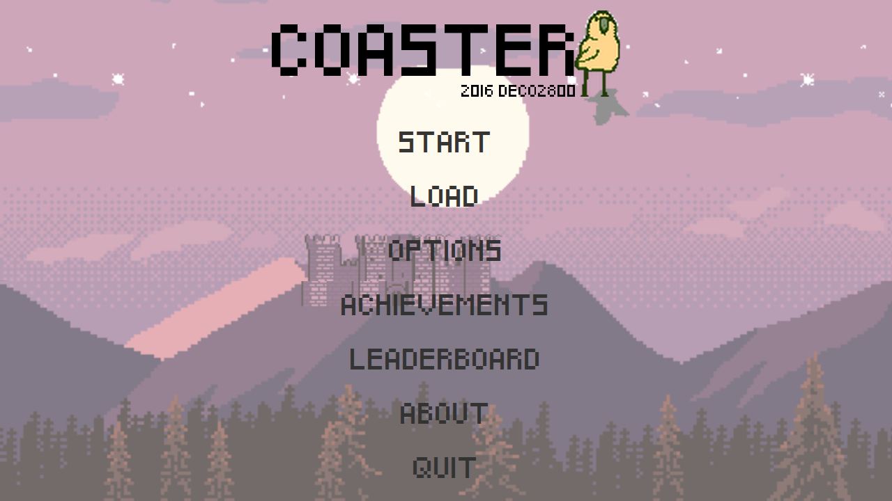

# Coaster

## Best Open Source Project - 2016 Innovation Showcase
Coaster received the Paul Gampe Prize for "Best Open Source Project" in the 2016 UQ Innovation Showcase.

## Description
A 2D sci-fi adventure game. Created by the 2016 [members](CREDITS) of DECO2800 workshop #4

To play, execute `./gradlew build run`

## Game Controls
## Movement
*Button* | *Action*
 ----- | -----
     A | Move Left
     D | Move Right
     S | Move Down
     W | Move Up
 Space | Jump
 Shift | Dash/AirDash
  Ctrl | Slide

## Combat
*Button* | *Action*
----- | ----- 	 
     Z | MouseButton1 | Shoot
     X | Firin' Lazors
     Q | Skill 1
     F | Skill 2
     E | Skill 3
     R | Skill 4
     ⇦ | A
     ⇨ | D
 Space | Jump
 Shift | Dash/AirDash
  Ctrl | Slide
    1  | Switch to active Weapon 1
    2  | Switch to active Weapon 2
    3  | Switch to active Weapon 3
    4  | Switch to active Weapon 4
    5  | Switch to active Weapon 5
    6  | Switch to active Weapon 6
    7  | Switch to active Weapon 7

=======
## Misc
 *Button* | *Action*
 ----- | -----
     K | Save
     L | Load
   ESC | Quit
     I | Inventory Screen
    J  | Toggle Debug
     BackSpace | Delete block under cursor
    Enter  | Add Dirt block to under cursor
    N  | Add NPC under cursor. Define the NPC using the environment variable `DEBUG_NPC` (eg. `export DEBUG_NPC=RangedEnemyNPC`)
	H  | Toggle Hitboxes
     = | Swap the buttons for the next two keys pressed
     F1 | Displays the action associated with the next key pressed
     M  | Mute/Unmute Sound
     ,  | Volume Down
     .  | Volume Up
     \  | Debug Console

*Sound is currently muted by default. Press M to unmute*
